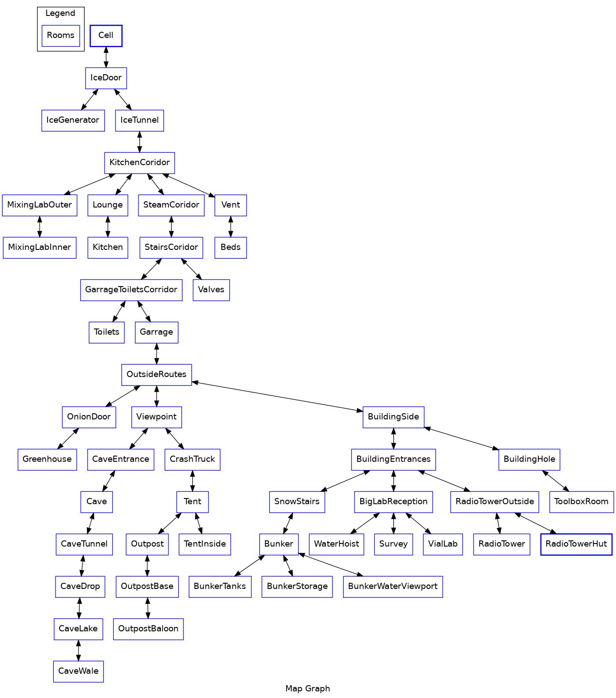

# facility-47-speedrun

I picked up this game for a couple of £ on Steam, really enjoyed it, and was interested in seeing how fast I could run it when I knew all the answers to the puzzles! I've never run a speedrun before, and from a very quick check of YouTube I didn't find any speedrun videos (altough I did find several complete walkthroughs). I've never done a speedrun of any game really, but I enjoy watching them. 

I've put my route, and notes on Github as I'm a programmer, and GitHub is a familar platform I use for collaboation, keen to share what I've found and put up my first speedrun video in the next few days!

## Videos

[19m 18s] https://youtu.be/CYx6lxRjb_k

## Route (high level)

Still very much in the process of writing all the details down

```
Checkpoint: Start
  Hot water
  Lab code: 061437
Checkpoint: Mixing lab unlocked
  Make acid
  Mop server room
  Code: 20 12 14
  Modem
  Get cogs
Checkpoint: Crane lifted
  Onion room
  Car case
  Shovel
  Ladder
  Toolbox key
  Snow stairs
Checkpoint: Bunker unlocked
  Floating case: 2513
  Card writer
  Roof room
    Door code: 123640
    Computer code: 112267
  TV Tape
  VIAL TIME
    Water winch: RRR URU RUU LLD LLL UUU
  Lab vials: Yellow Blue Purple Yellow Red
Checkpoint: Punched Card
  Valve room
Finish: Respond on Radio
```

## Speedrun category

I'm not entirely sure how this is done in the community, but I started timing from clicking "Start Game" and stopped timing when I clicked one of the radio buttons - so I'm calling this a "Respond Radio" category, which might be also called "Any %". Several in game items skipped - and the game ends when you click the radio, so, that's why I guess.

## Optimization notes

* I am 33, used to playing slower games, for sure someone can execute this run faster than me! :-) :-( ! 
* The game has several action animations that can be skipped by hitting "back", and you can still collect the item after the long animation (most notable examples are the code card, and Titan fluid. 
* There seem to be several skippable items and actions - eg, you don't need to do; dart+baloon+batteries, or use the dropper on the vials + use the blackboard. I've obviously skipped those from my route. 
* If you could re-bind mice keys to click the "back" button it would save some mouse movement time
* A vial skip would be huge - it's probably 30% of the gameplay

## Reference

## Map (as a undirected graph) 

This is a computer sciencey thing - with the map as an undirected graph it should be easier to find route optimizations (visually, and using code). The map is written in the Graphviz dot language. 



## Rooms

Cell 
IceDoor
IceGenerator
IceTunnel...
...

## Items

TODO: Make full list of items

### Essential

* Knife: TV Fuse + Triangle key
* Paperweight + Coathanger + Knife: Smashed glass -> Shower grate -> Triangle Key
* The 5 vials - the punchcard machine does not seem to work otherwise (says you need to find more samples)
* ...

### Optional

* Dart: baloon -> batteries -> dictaphone -> case code - if skippable sequence when you know the code.
* ...
